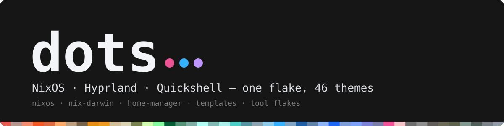
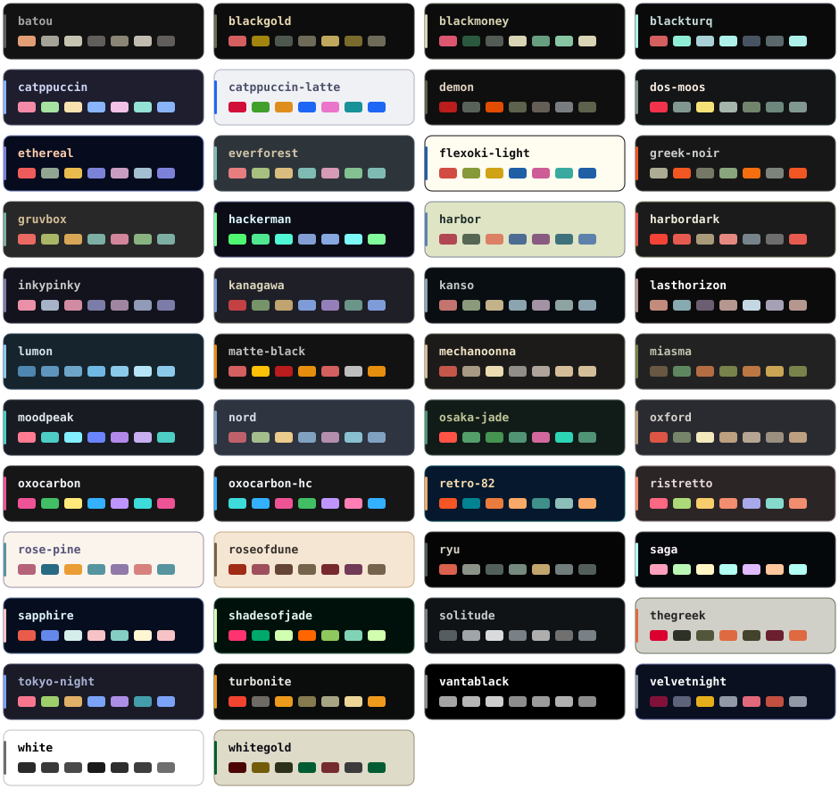

<p align="center">
  
</p>

<p align="center">
  <a href="https://nixos.org"></a>
  <a href="https://hyprland.org"></a>
  <a href="https://quickshell.org"></a>
  
  <a href="https://github.com/Ziad0dev/dots/commits/main"></a>
</p>

<p align="center">
  <a href="https://github.com/Ziad0dev/dots/wiki"><b>Wiki</b></a> ·
  <a href="docs/install.md">Install</a> ·
  <a href="docs/desktop.md#keybinds">Keybinds</a> ·
  <a href="docs/theming.md">Themes</a> ·
  <a href="docs/troubleshooting.md">Troubleshooting</a>
</p>


One flake for a NixOS + Hyprland desktop, a nix-darwin Mac, and standalone home-manager on anything else with Nix. Config under `config/` is symlinked live, so most edits land without a rebuild; `themectl` recolours the whole session — bar, borders, terminal, lock screen, login greeter, editor — in one command.

## Highlights

| | |
|---|---|
| **Desktop** | Hyprland (Lua config), a heavily reworked [Quickshell](https://quickshell.org) bar with launcher, overview and control panel, Quickshell lock screen, custom SDDM greeter |
| **Themes** | 46 palettes, 13 app templates, live switching with `themectl set <name>` — no rebuild, no git diff |
| **Hardware** | CachyOS kernel via chaotic-nyx, NVIDIA open driver, 10-bit HDR on the OLED, RAPL/EPP tuning |
| **Services** | Jellyfin with NVENC, a WireGuard-confined download stack, local LLMs on llama.cpp (Vulkan), restic backups |
| **Dev** | Nine `nix flake init` templates, curated infosec and maths tool flakes, a disposable agent VM |
| **Portable** | Same flake builds `nixos`, `mac` and four home-manager profiles — see [architecture](docs/architecture.md) |

## Install

```sh
git clone https://github.com/Ziad0dev/dots ~/dots
cd ~/dots
nixos-rebuild switch --flake .#nixos
```

Edit `flake.nix` first — `username` is at the top — and replace `hosts/nixos/hardware-configuration.nix` with your own. The desktop output is built for one machine: [Getting started](docs/install.md) lists every value to change, the files that must exist out-of-band, and the macOS / non-NixOS routes.

After that:

```sh
git add -A && nh os switch
```

`git add` is required — untracked files are invisible to the flake.

## Themes

<p align="center">
  
</p>

```sh
themectl set kanagawa     # or SUPER + CTRL + SHIFT + Space for the picker
```

Adding one is a directory with a `colors.sh` — [Theming](docs/theming.md).

## Keys you'll want first

| | |
|---|---|
| `SUPER + Return` | terminal |
| `SUPER + D` / `SUPER + A` | launcher / overview |
| `SUPER + V` | dictation (whisper.cpp) |
| `SUPER + SHIFT + V` | clipboard history |
| `SUPER + CTRL + SHIFT + Space` / `SUPER + E` | theme / wallpaper picker |
| `SUPER + ALT + R` → `SUPER + SHIFT + R` | arm replay buffer → save last 5 min |
| `Print` | region screenshot → annotate |
| `SUPER + Escape` | lock |

The rest: [Desktop → keybinds](docs/desktop.md#keybinds).

## Layout

```
flake.nix     username, hostnames, every output
hosts/        nixos/ · darwin/ · claude-vm/
modules/      system config, one file per concern
home/         home-manager: profiles/ + one module per app
config/       app config, symlinked live into ~/.config
flakes/       curated tool sets, usable standalone
templates/    nix flake init templates
scripts/      themectl, the dots-* shims, voxtype, git hook
docs/         documentation — also published as the wiki
```

## Templates and tool flakes

```sh
nix flake new -t github:Ziad0dev/dots#zig myproject    # zig rust haskell c python lisp beam typst latex
nix develop 'github:Ziad0dev/dots?dir=flakes/infosec#web' -c fish
nix develop 'github:Ziad0dev/dots?dir=flakes/maths#mathlib' -c fish
```

## Documentation

Everything past this README lives in [`docs/`](docs/README.md), mirrored to the [wiki](https://github.com/Ziad0dev/dots/wiki) on every push.

[Getting started](docs/install.md) · [Workflow](docs/workflow.md) · [Architecture](docs/architecture.md) · [System modules](docs/modules.md) · [Services](docs/services.md) · [Desktop](docs/desktop.md) · [Theming](docs/theming.md) · [Development](docs/development.md) · [Scripts & commands](docs/scripts.md) · [Troubleshooting](docs/troubleshooting.md) · [Nix cheatsheet](docs/nix-cheatsheet.md)

## Credits

- **Quickshell bar** — a fork of [HANCORE-linux/quickshell-dots](https://github.com/HANCORE-linux/quickshell-dots) (MIT, see [`config/quickshell/rise/LICENSE`](config/quickshell/rise/LICENSE)).
- **Theme palettes and bundled wallpapers** — largely adapted from [omarchy](https://github.com/basecamp/omarchy) (MIT) and the HANCORE-linux theme repos (MIT); original artwork belongs to its authors.
- **KvGlass / Glass-Kv** Kvantum theme — Victor Calles (GPL).
- Built on [chaotic-nyx](https://github.com/chaotic-cx/nyx), [home-manager](https://github.com/nix-community/home-manager), [nix-darwin](https://github.com/nix-darwin/nix-darwin), [VPN-Confinement](https://github.com/Maroka-chan/VPN-Confinement) and [nh](https://github.com/nix-community/nh).
