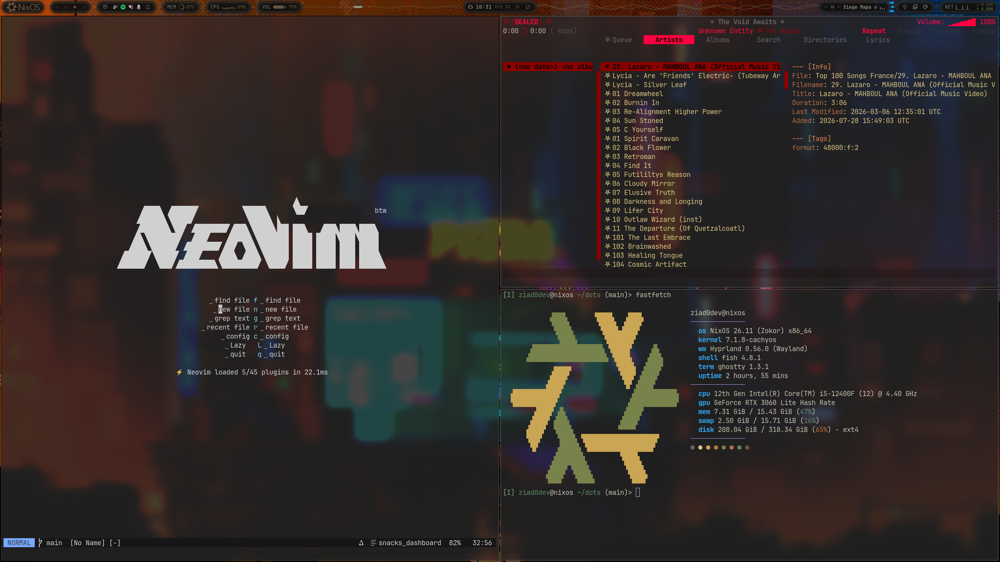

# dots

NixOS + Hyprland. Quickshell bar, Ghostty, Neovim, Zen.



## Install

```sh
git clone https://github.com/Ziad0dev/dots ~/dots
cd ~/dots
nixos-rebuild switch --flake .#nixos
```

Edit `flake.nix` first — `hostname` and `username` are set at the top — and
replace `hosts/nixos/hardware-configuration.nix` with your own.

## Stack

| | |
| --- | --- |
| WM | Hyprland (Lua config) |
| Bar | Quickshell |
| Terminal | Ghostty |
| Editor | Neovim, Emacs |
| Music | mpd + rmpc |
| Browser | Zen |
| Shell | Fish |
| Theme | 20 themes, switch with `themectl set <name>` |

## Rebuilding

```sh
git add -A && nh os switch
```

`git add` is required — untracked files are invisible to the flake.

## Layout

```
flake.nix     hostname, username, host outputs
hosts/        per-host hardware + configuration
modules/      system config, one file per concern
home/         home-manager
config/       app config, symlinked live into ~/.config
scripts/      helpers
```
