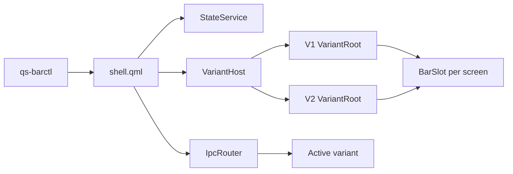

# Understand Quickshell Rise architecture

This guide explains the shared bootstrap, isolated V1 and V2 roots, lifecycle controller, inter-process communication (IPC), persistent state, and repository layout. Rise deploys both interfaces as one shell generation but instantiates only the selected variant.

## Follow the runtime structure

One `ShellRoot` owns state, variant loading, and IPC. The active `VariantRoot` creates one bar surface for each valid Wayland output.



The inactive variant has no loaded panels, timers, windows, or exclusive zone. V1 and V2 therefore do not need separate Quickshell processes.

## Load and switch variants

`VariantHost` implements the interface lifecycle. A normal switch follows these phases:

1. Ask the active variant to close panels and lock its layout
2. Wait until deactivation reports complete
3. Destroy the old loader item and its layer-shell windows
4. Load the target `VariantRoot`
5. Wait for every real screen and bar controller to report ready
6. Require stable readiness before accepting the target
7. Persist the selected variant with an atomic write

If the target fails to load or become ready, the host unloads it and reloads the previous variant. A failed persistence write also returns to the previous variant when one exists.

Each variant defines readiness from its real runtime state. It requires loaded layout settings, at least one valid output, one registered bar controller per output, and visible backing windows.

## Store shared and variant state

`StateService` stores the accepted interface at `~/.local/state/quickshell-rise/active-variant`. It reads the legacy `active-version` file during migration and defaults to V1 when neither file contains a valid value.

Interface settings remain separate:

- V1 widget settings: `~/.cache/quickshell_widgets`
- V2 widget settings: `~/.cache/quickshell_widgets_v2`
- V1 and V2 layout order: separate variant-specific cache files
- Shared media, thumbnail, update, and notification caches: reused where both interfaces consume the same data

The deployed QML directory contains source and installation markers, not mutable interface state. An update can replace that directory without resetting the accepted variant.

## Route IPC through one host

`IpcRouter` owns the stable Quickshell IPC handlers. It delegates UI actions to the active variant and queues selected events while a switch is in progress.

The public handlers include:

- `lifecycle`: report `version()` and `ready()`
- `variant`: report state or request a V1/V2 activation
- `layout`: lock or unlock drag-and-drop mode
- `theme`: apply theme and launcher payloads or reload theme state
- `picker`: open theme, wallpaper, screenshot, or video pickers
- `omarchy.system-update`: refresh package state

The lifecycle controller first resolves exactly one registered Rise instance. It then calls IPC by instance ID, so a command cannot reach an unrelated Quickshell application.

## Control the process lifecycle

`qs-barctl` is the installed lifecycle boundary. Mutating commands re-enter the controller in a transient systemd user worker, and a separate transient unit owns the bar process.

The controller uses the exact installed path `~/.config/quickshell/bar/shell.qml` for registry selection. It validates the instance ID, process, registry links, reported variant, readiness, and stable single-instance count.

This separation protects three operations:

- Starting a bar from a panel does not tie the new process to the old variant’s cgroup
- Duplicate or degraded Rise instances can be normalized without killing foreign `qs` processes
- A switch changes the loaded variant inside the existing process instead of overlapping two bars

## Deploy and update one generation

`versions/V1` is the deployable payload despite its historical directory name. It contains the common bootstrap, the V1 root, and the complete V2 bundle.

The shell updater stages that payload with its controller, hooks, update scripts, and systemd files. It validates pinned repository objects before replacing the installed generation. The active variant state remains outside the transaction.

The payload swap uses same-filesystem renames. If a companion step or restart fails, rollback restores the previous payload and companion files before it restarts the prior generation.

## Navigate the repository

The main project surfaces are:

```text
versions/V1/
├── shell.qml
├── VariantRoot.qml
├── core/
├── variants/V2/
├── modules/
└── panels/
scripts/
hooks/
contrib/post-boot.d/
systemd/
tests/
install.sh
uninstall.sh
```

The V1 and V2 directories retain their own `Theme.qml`, `BarSlot.qml`, modules, and panels. Move code into a shared layer only when both variants use the same stable contract.

Read [Develop Quickshell Rise](development.md) for repository startup, regression suites, linting, and release checks.

[Back to the project README](../README.md)
